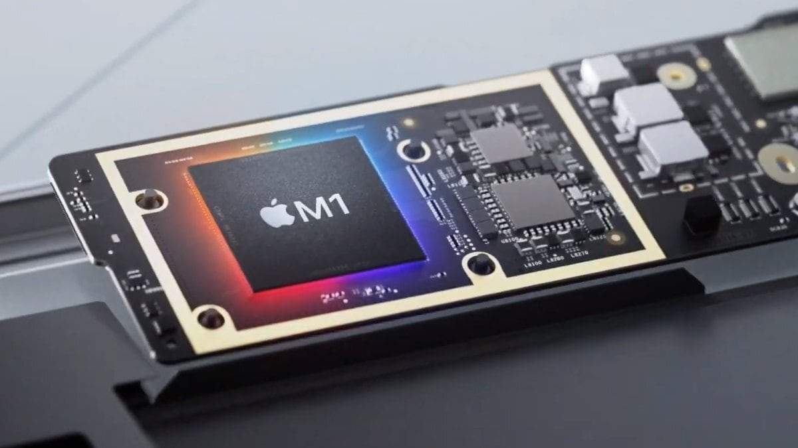

## Is the future?
Yeah, this is the future. I could define arm as a complex, advanced and very light architecture this allows it to be used in small devices such as pi or smartphones.

## Apple M1
The new apple m1 is a total innovation, one of the most popular and popular computers using the 100% arm architecture, the process was difficult and some applications did not work at first but once it was adapted it made us all want to have a macbook again for its new chip created by apple.

## Pi's
Another very large example that we have been with for several years are the cheap and small pi computers that are powered by arm, here are some examples:

### Raspberry Pi
The most famous Pi Raspberry Pi is an arm type board that is used today for many things from hacking to companies because it is very configurable and you can have Linux, we have seen with each version of the board how it has been improving in performance and only in the 4 generations the board is very powerful.

### Banana Pi
A competition from the raspberry, they are very the same, it can also run a lot of the raspberry even its official system.

### Pine64
Pine64 manufactures flat arm that although they are not very well known is another step towards all of us using arm

## Conclusion
Conclusion: This was a bit short but not a filler post, I consider that arm has great potential and we should start working on it all from creating things for arm to working on it.

Now a video from youtube :smile::

