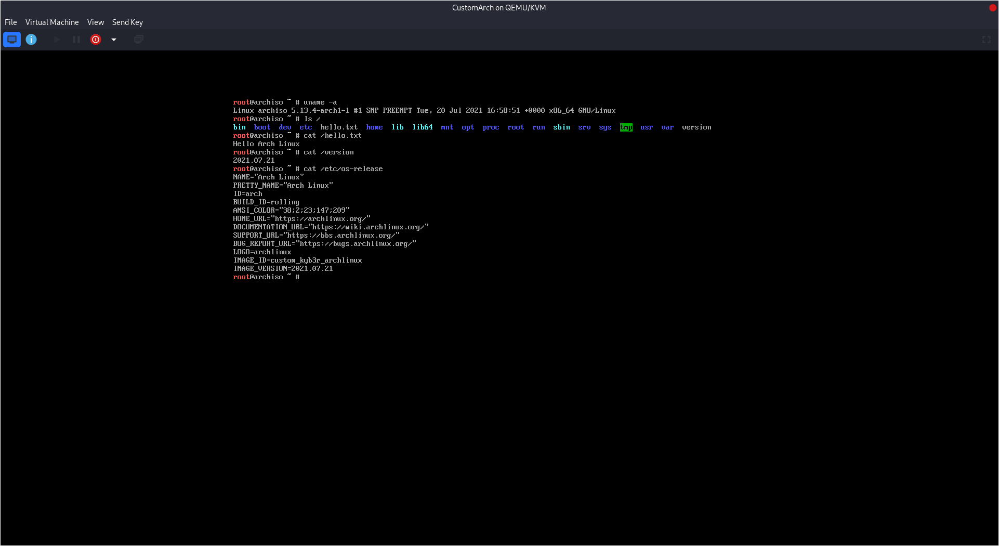

A bit illogical, right? The [first post](/posts/why-not-create-more-linux-distributions) on my blog was the reason why I didn't create any more distributions and today I am teaching you how to make a custom Arch Linux image. But do not create another Linux just modify Arch to your liking and keep it as an Arch.But more than one will use this to create another "distribution" (Please don't). Then...



But hey, we better start.

## Why create a custom Arch Linux image?
It is tedious having to personally configure Arch Linux every time you install it, so you can generate your own image with all your configuration and not have to do this process over and over again.

### Do not create another distribution
Please, as I already explained in the [post](/posts/why-not-create-more-linux-distributions) that talks about this, do not create another one based on Arch, create a customazida image for yourself but do not rename the distro or the promotions as a new one only as a customization.

## Requirements
The requirements for this tutorial will be:

- [An updated pure Arch Linux](https://archlinux.org/download).
- At least 25GB of storage on Arch Linux.

## Starting


Remember that during the whole process you must be the **root** user or do it with sudo.


We will use Archiso which is the Official way to generate an Arch Linux image. First we will have to install the dependencies in our Arch Linux this we will do with:

```shell
pacman -Sy archiso
```

After installing it you will have to make a copy of one of the two configurations, the options are releng and baseline the differences are:

- **releng** is used to create the official monthly installation ISO. It can be used as a starting point for creating a customized ISO image.
- **baseline** is a minimalistic configuration, that includes only the bare minimum packages required to boot the live environment from the medium.

In this tutorial we will use the releng configuration, if you want to use baseline you can also use this tutorial only in the places where it says releng change it to baseline. We will create a copy of the configuration chosen with the command:

```shell
cp -r /usr/share/archiso/configs/releng customarch
```

We will enter the newly created folder with ```cd customarch```.

### Archiso structure
The file structure is:

- :(fas fa-file-alt ): **pacman.conf** It is the configuration file of the pacman package manager and in which we will add the repositories that we want for custom packages that are already installed in our archcustom.
- :(fas fa-file-alt): **packages.x86_64** List of packages that our customarchiso will bring by default.
- :(fas fa-folder): **airootfs** This folder should be treated as the root (**/**) of our new system.
- :(fas fa-folder): **efiboot** Configuration files for UEFI boot mode.
- :(fas fa-folder): **syslinux** Configuration files for Legacy boot mode.

### pacman.conf
You can edit the pacman.conf and add a custom repository with the packages that you like, it is recommended to leave it by default since it will bring the Arch Linux repositories but you could add the Manjaro ones if you like.

### packages.x86_64
Here you can add the packages / software that you want the system to bring, for example if you want it to have firefox you can add the firefox package, it is recommended if you do not know what you are eliminating, do not do it since you could eliminate something necessary such as the kernel. My package file looks like this:

```text
#
# SPDX-License-Identifier: GPL-3.0-or-later
alsa-utils
amd-ucode
arch-install-scripts
archinstall
b43-fwcutter
base
bind-tools
brltty
broadcom-wl
btrfs-progs
clonezilla
cloud-init
crda
cryptsetup
darkhttpd
ddrescue
dhclient
dhcpcd
diffutils
dmraid
dnsmasq
dosfstools
e2fsprogs
edk2-shell
efibootmgr
espeakup
ethtool
exfatprogs
f2fs-tools
fatresize
fsarchiver
gnu-netcat
gpart
gpm
gptfdisk
grml-zsh-config
hdparm
intel-ucode
ipw2100-fw
ipw2200-fw
irssi
iw
iwd
jfsutils
kitty-terminfo
less
lftp
libfido2
libusb-compat
linux
linux-atm
linux-firmware
livecd-sounds
lsscsi
lvm2
lynx
man-db
man-pages
mc
mdadm
memtest86+
mkinitcpio
mkinitcpio-archiso
mkinitcpio-nfs-utils
modemmanager
mtools
nano
nbd
ndisc6
nfs-utils
nilfs-utils
nmap
ntfs-3g
nvme-cli
openconnect
openssh
openvpn
partclone
parted
partimage
pcsclite
ppp
pptpclient
pv
qemu-guest-agent
reflector
reiserfsprogs
rp-pppoe
rsync
rxvt-unicode-terminfo
screen
sdparm
sg3_utils
smartmontools
sof-firmware
squashfs-tools
sudo
syslinux
systemd-resolvconf
tcpdump
terminus-font
testdisk
tmux
tpm2-tss
udftools
usb_modeswitch
usbmuxd
usbutils
vim
virtualbox-guest-utils-nox
vpnc
wireless-regdb
wireless_tools
wpa_supplicant
wvdial
xfsprogs
xl2tpd
zsh

# My custom packages
firefox
lsd
git
vim
lynx
neofetch
aircrack-ng
```

### airootfs
Here you can place your dotfiles type files since it is the root of our system, I will only create a file with the name hello.txt

### syslinux
Here are two very important files which are splash.png and. Here what is each one of them for?

#### splash.png
Boot image when we do it through Legacy is the typical Arch Linux image and there will be a custom image, mine was:


### archiso_head.cgf
Here will go the configuration of the boot header including its colors, although there are more files that you can also configure to make your Arch Linux custom, just modifying these two are enough, mine is like this:

```text
#!/usr/bin/env bash
# shellcheck disable=SC2034

iso_name="custom_kyb3r_archlinux"
iso_label="ARCH_$(date +%Y%m)"
iso_publisher="Arch Linux <https://archlinux.org>"
iso_application="Arch Linux Custom Kyb3r Live/Rescue CD"
iso_version="$(date +%Y.%m.%d)"
install_dir="arch"
buildmodes=('iso')
bootmodes=('bios.syslinux.mbr' 'bios.syslinux.eltorito' 'uefi-x64.systemd-boot.esp' 'uefi-x64.systemd-boot.eltorito')
arch="x86_64"
pacman_conf="pacman.conf"
airootfs_image_type="squashfs"
airootfs_image_tool_options=('-comp' 'xz' '-Xbcj' 'x86' '-b' '1M' '-Xdict-size' '1M')
file_permissions=(
  ["/etc/shadow"]="0:0:400"
  ["/root"]="0:0:750"
  ["/root/.automated_script.sh"]="0:0:755"
  ["/usr/local/bin/choose-mirror"]="0:0:755"
  ["/usr/local/bin/Installation_guide"]="0:0:755"
  ["/usr/local/bin/livecd-sound"]="0:0:755"
)
```

## Bulding Image
To start building the image we will have to create two folders **work** and **out** with the command: ```mkdir {work,out}```.

### mkarchiso
You are now ready to generate your custom image, this you will do with mkarchiso here are some important parameters:

- **-v** To have verbose and see how our system goes in terms of construction.
- **-w** Work folder, after this the folder can be deleted, our work folder will be work that we created earlier.
- **-o** Output folder, here file will give us our new image, our folder will be out that was created previously.

To build the image run:
```
mkarchiso -v -w work -o out /root/archcustom
```

My log of my archcustom was this:

```text open=false
[mkarchiso] INFO: Validating options...
[mkarchiso] INFO: Done!
[mkarchiso] INFO: mkarchiso configuration settings
[mkarchiso] INFO:              Architecture:   x86_64
[mkarchiso] INFO:         Working directory:   /root/customarch/work
[mkarchiso] INFO:    Installation directory:   arch
[mkarchiso] INFO:                Build date:   2021-07-21T19:26:08+00:00
[mkarchiso] INFO:          Output directory:   /root/customarch/out
[mkarchiso] INFO:        Current build mode:   iso
[mkarchiso] INFO:               Build modes:   iso
[mkarchiso] INFO:                   GPG key:   None
[mkarchiso] INFO: Code signing certificates:   
[mkarchiso] INFO:                   Profile:   /root/customarch
[mkarchiso] INFO: Pacman configuration file:   /root/customarch/pacman.conf
[mkarchiso] INFO:           Image file name:   custom_kyb3r_archlinux-2021.07.21-x86_64.iso
[mkarchiso] INFO:          ISO volume label:   ARCH_202107
[mkarchiso] INFO:             ISO publisher:   Arch Linux <https://archlinux.org>
[mkarchiso] INFO:           ISO application:   Arch Linux Custom Kyb3r Live/Rescue CD
[mkarchiso] INFO:                Boot modes:   bios.syslinux.mbr bios.syslinux.eltorito uefi-x64.systemd-boot.esp uefi-x64.systemd-boot.eltorito
[mkarchiso] INFO:             Packages File:   /root/customarch/packages.x86_64
[mkarchiso] INFO:                  Packages:   alsa-utils amd-ucode arch-install-scripts archinstall b43-fwcutter base bind-tools brltty broadcom-wl btrfs-progs clonezilla cloud-init crda cryptsetup darkhttpd ddrescue dhclient dhcpcd diffutils dmraid dnsmasq dosfstools e2fsprogs edk2-shell efibootmgr espeakup ethtool exfatprogs f2fs-tools fatresize fsarchiver gnu-netcat gpart gpm gptfdisk grml-zsh-config hdparm intel-ucode ipw2100-fw ipw2200-fw irssi iw iwd jfsutils kitty-terminfo less lftp libfido2 libusb-compat linux linux-atm linux-firmware livecd-sounds lsscsi lvm2 lynx man-db man-pages mc mdadm memtest86+ mkinitcpio mkinitcpio-archiso mkinitcpio-nfs-utils modemmanager mtools nano nbd ndisc6 nfs-utils nilfs-utils nmap ntfs-3g nvme-cli openconnect openssh openvpn partclone parted partimage pcsclite ppp pptpclient pv qemu-guest-agent reflector reiserfsprogs rp-pppoe rsync rxvt-unicode-terminfo screen sdparm sg3_utils smartmontools sof-firmware squashfs-tools sudo syslinux systemd-resolvconf tcpdump terminus-font testdisk tmux tpm2-tss udftools usb_modeswitch usbmuxd usbutils vim virtualbox-guest-utils-nox vpnc wireless-regdb wireless_tools wpa_supplicant wvdial xfsprogs xl2tpd zsh firefox lsd git vim lynx aircrack-ng
[mkarchiso] INFO: Copying custom pacman.conf to work directory...
[mkarchiso] INFO: Using pacman CacheDir: /var/cache/pacman/pkg/ 
[mkarchiso] INFO: Copying custom airootfs files...
[mkarchiso] INFO: Done!
[mkarchiso] INFO: Installing packages to '/root/customarch/work/x86_64/airootfs/'...
==> Creating install root at /root/customarch/work/x86_64/airootfs
==> Installing packages to /root/customarch/work/x86_64/airootfs
:: Synchronizing package databases...
 core downloading...
 extra downloading...
 community downloading...
resolving dependencies...
:: There are 8 providers available for ttf-font:
:: Repository extra
   1) gnu-free-fonts  2) noto-fonts  3) ttf-bitstream-vera  4) ttf-croscore  5) ttf-dejavu
:: Repository community
   6) ttf-droid  7) ttf-ibm-plex  8) ttf-liberation

Enter a number (default=1): 
looking for conflicting packages...

Packages (487) acl-2.3.1-1  adobe-source-code-pro-fonts-2.038ro+1.058it+1.018var-1  adwaita-icon-theme-40.1.1-1  alsa-lib-1.2.5.1-3  alsa-topology-conf-1.2.5.1-1  alsa-ucm-conf-1.2.5.1-1  aom-3.1.1-1  archlinux-keyring-20210616-1  argon2-20190702-3  at-spi2-atk-2.38.0-1  at-spi2-core-2.40.3-1  atk-2.36.0-1  attr-2.5.1-1  audit-3.0.2-1  avahi-0.8+20+gd1e71b3-1  awesome-terminal-fonts-1.1.0-4  bash-5.1.008-1  bc-1.07.1-4  bluez-libs-5.60-1  brotli-1.0.9-4  bzip2-1.0.8-4  ca-certificates-20210603-1  ca-certificates-mozilla-3.68-1  ca-certificates-utils-20210603-1  cairo-1.17.4-5  cantarell-fonts-1:0.301-1  cifs-utils-6.13-2  coreutils-8.32-1  curl-7.78.0-1  dav1d-0.9.0-1  db-5.3.28-5  dbus-1.12.20-1  dbus-glib-0.112-1  dconf-0.40.0-1  desktop-file-utils-0.26-1  device-mapper-2.03.12-1  ding-libs-0.6.1-3  dnssec-anchors-20190629-3  drbl-2.30.5-1  ecryptfs-utils-111-4  efivar-37-4  ell-0.41-1  espeak-ng-1.50-4  expat-2.4.1-1  ffmpeg-2:4.4-4  file-5.40-5  filesystem-2021.05.31-1  findutils-4.8.0-1  flac-1.3.3-3  fontconfig-2:2.13.94-1  freetype2-2.10.4-1  fribidi-1.0.10-1  fuse-common-3.10.4-1  fuse2-2.9.9-4  fuse3-3.10.4-1  gawk-5.1.0-1  gcc-libs-11.1.0-1  gdbm-1.20-1  gdk-pixbuf2-2.42.6-1  gettext-0.21-1  giflib-5.2.1-2  glib-networking-1:2.68.1-1  glib2-2.68.3-1  glibc-2.33-5  gmp-6.2.1-1  gnu-free-fonts-20120503-8  gnupg-2.2.29-1  gnutls-3.7.2-2  gpgme-1.16.0-1  graphite-1:1.3.14-1  grep-3.6-1  groff-1.22.4-6  gsettings-desktop-schemas-40.0-3  gsm-1.0.19-1  gssproxy-0.8.4-1  gtk-update-icon-cache-1:4.2.1-2  gtk3-1:3.24.30-1  gzip-1.10-3  harfbuzz-2.8.2-1  hicolor-icon-theme-0.17-2  hidapi-0.10.1-1  hwids-20210613-1  hwloc-2.5.0-1  iana-etc-20210624-1  icu-69.1-1  inetutils-2.0-1  iproute2-5.13.0-1  iptables-1:1.8.7-1  iputils-20210202-1  iso-codes-4.6.0-1  jack-0.125.0-9  jansson-2.13.1-1  js78-78.12.0-1  json-c-0.15-1  json-glib-1.6.2-1  kbd-2.4.0-2  keyutils-1.6.3-1  kmod-29-1  krb5-1.19.1-1  l-smash-2.14.5-2  lame-3.100-3  lbzip2-2.5-5  lcms2-2.12-1  ldb-1:2.4.0-1  ldns-1.7.1-2  libaio-0.3.112-2  libarchive-3.5.1-1  libass-0.15.1-1  libassuan-2.5.5-1  libasyncns-0.8+3+g68cd5af-3  libavc1394-0.5.4-4  libbluray-1.3.0-1  libbsd-0.10.0-2  libcanberra-0.30+2+gc0620e4-5  libcap-2.51-1  libcap-ng-0.8.2-1  libcbor-0.8.0-1  libcloudproviders-0.3.1-2  libcolord-1.4.5-4  libcroco-0.6.13-2  libcups-1:2.3.3op2-3  libdaemon-0.14-5  libdatrie-0.2.13-1  libdrm-2.4.107-1  libedit-20210522_3.1-1  libelf-0.185-1  libepoxy-1.5.8-1  libevent-2.1.12-1  libffi-3.3-4  libgcrypt-1.9.3-1  libglvnd-1.3.3-1  libgpg-error-1.42-1  libgudev-236-1  libibus-1.5.24-1  libice-1.0.10-3  libidn-1.37-1  libidn2-2.3.1-1  libiec61883-1.2.0-6  libimobiledevice-1.3.0-3  libinih-53-1  libjpeg-turbo-2.1.0-1  libksba-1.6.0-1  libldap-2.4.59-1  liblouis-3.18.0-1  libmaxminddb-1.6.0-1  libmbim-1.24.8-1  libmfx-21.2.3-1  libmm-glib-1.16.6-1  libmnl-1.0.4-3  libmodplug-0.8.9.0-3  libnetfilter_conntrack-1.0.8-1  libnewt-0.52.21-5  libnfnetlink-1.0.1-4  libnftnl-1.2.0-1  libnghttp2-1.43.0-1  libnl-3.5.0-3  libnsl-1.3.0-2  libogg-1.3.5-1  libomxil-bellagio-0.9.3-3  libotr-4.1.1-3  libp11-kit-0.24.0-1  libpcap-1.10.1-1  libpciaccess-0.16-2  libpipeline-1.5.3-1  libplist-2.2.0-3  libpng-1.6.37-3  libproxy-0.4.17-2  libpsl-0.21.1-1  libpulse-14.2-3  libqmi-1.28.6-1  libqrtr-glib-1.0.0-1  libraw1394-2.1.2-3  librsvg-2:2.50.7-1  libsamplerate-0.2.1-1  libsasl-2.1.27-3  libseccomp-2.5.1-2  libsecret-0.20.4-1  libsm-1.2.3-2  libsndfile-1.0.31-1  libsoup-2.72.0+10+gfe1e295d-1  libsoxr-0.1.3-2  libspeechd-0.10.2-1  libssh-0.9.5-1  libssh2-1.9.0-3  libtasn1-4.17.0-1  libthai-0.1.28-2  libtheora-1.1.1-5  libtiff-4.3.0-1  libtirpc-1.3.2-1  libtool-2.4.6+42+gb88cebd5-16  libunistring-0.9.10-3  libunwind-1.5.0-1  liburing-2.0-1  libusb-1.0.24-2  libusbmuxd-2.0.2-1  libutempter-1.2.1-1  libuv-1.42.0-1  libva-2.12.0-1  libvdpau-1.4-1  libvorbis-1.3.7-2  libvpx-1.10.0-1  libwebp-1.2.0-1  libx11-1.7.2-1  libxau-1.0.9-3  libxcb-1.14-1  libxcomposite-0.4.5-3  libxcrypt-4.4.23-1  libxcursor-1.2.0-2  libxdamage-1.1.5-3  libxdmcp-1.1.3-3  libxext-1.3.4-3  libxfixes-6.0.0-1  libxft-2.3.3-2  libxi-1.7.10-3  libxinerama-1.1.4-3  libxkbcommon-1.3.0-1  libxml2-2.9.10-9  libxrandr-1.5.2-3  libxrender-0.9.10-4  libxshmfence-1.3-2  libxt-1.2.1-1  libxtst-1.2.3-4  libxv-1.0.11-4  libxxf86vm-1.1.4-4  libyaml-0.2.5-1  licenses-20200427-1  linux-api-headers-5.12.3-1  llvm-libs-12.0.1-1  lm_sensors-1:3.6.0.r41.g31d1f125-1  lmdb-0.9.29-1  lrzip-0.641-1  lua53-5.3.6-1  lz4-1:1.9.3-2  lzo-2.10-3  lzop-1.04-3  mailcap-2.1.53-1  mesa-21.1.5-1  mkinitcpio-busybox-1.33.1-1  mobile-broadband-provider-info-20201225-1  mpfr-4.1.0-2  ncurses-6.2-2  net-tools-2.10-1  netplan-0.102-1  nettle-3.7.3-1  nfsidmap-2.5.4-1  npth-1.6-3  nspr-4.32-1  nss-3.68-1  opencore-amr-0.1.5-5  openjpeg2-2.4.0-1  openssl-1.1.1.k-1  openssl-1.0-1.0.2.u-1  opus-1.3.1-2  p11-kit-0.24.0-1  pacman-6.0.0-5  pacman-mirrorlist-20210718-1  pam-1.5.1-1  pambase-20210605-2  pango-1:1.48.7-1  pbzip2-1.1.13-3  pcaudiolib-1.1-3  pciutils-3.7.0-1  pcre-8.45-1  pcre2-10.37-1  perl-5.34.0-1  perl-error-0.17029-3  perl-mailtools-2.21-5  perl-timedate-2.33-3  pigz-2.6-1  pinentry-1.1.1-1  pixman-0.40.0-1  pixz-1.0.7-2  pkcs11-helper-1.27.0-1  polkit-0.119-1  popt-1.18-1  procps-ng-3.3.17-1  progsreiserfs-0.3.0.5-10  psmisc-23.4-1  python-3.9.6-1  python-appdirs-1.4.4-3  python-attrs-21.2.0-1  python-cffi-1.14.6-1  python-chardet-4.0.0-2  python-configobj-5.0.6.r110.g3e2f4cc-1  python-cryptography-3.4.7-1  python-dnspython-1:1.16.0-3  python-idna-3.2-1  python-importlib-metadata-4.6.1-1  python-jinja-3.0.1-1  python-jsonpatch-1.32-1  python-jsonpointer-2.1-1  python-jsonschema-3.2.0-4  python-markdown-3.3.4-1  python-markupsafe-2.0.1-1  python-more-itertools-8.8.0-1  python-netifaces-0.11.0-1  python-oauthlib-3.1.1-1  python-ordered-set-4.0.2-3  python-packaging-20.9-1  python-ply-3.11-7  python-pycparser-2.20-3  python-pyparsing-2.4.7-3  python-pyrsistent-0.18.0-1  python-requests-2.26.0-1  python-setuptools-1:57.4.0-1  python-six-1.16.0-1  python-urllib3-1.26.6-1  python-yaml-5.4.1.1-2  python-zipp-3.5.0-1  rav1e-0.4.1-1  readline-8.1.001-1  rest-0.8.1-3  rpcbind-1.2.6-1  run-parts-4.11.2-1  sdl2-2.0.14-1  sed-4.8-1  shadow-4.8.1-4  shared-mime-info-2.0+57+gc1d1c70-1  slang-2.3.2-2  smbclient-4.14.6-1  sound-theme-freedesktop-0.8-4  speex-1.2.0-3  speexdsp-1.2.0-2  sqlite-3.36.0-1  srt-1.4.3-1  sshfs-3.7.2-1  stoken-0.92-4  svt-av1-0.8.7-1  sysfsutils-2.1.1-1  systemd-249.1-1  systemd-libs-249.1-1  systemd-sysvcompat-249.1-1  talloc-2.3.3-1  tar-1.34-1  tcl-8.6.11-1  tdb-1.4.4-1  tevent-1:0.11.0-1  texinfo-6.8-1  thin-provisioning-tools-0.9.0-1  tzdata-2021a-1  util-linux-2.37-3  util-linux-libs-2.37-3  v4l-utils-1.20.0-1  vid.stab-1.1-3  vim-runtime-8.2.2891-1  vmaf-1.5.3-1  vulkan-icd-loader-1.2.184-1  wayland-1.19.0-1  wayland-protocols-1.21-1  which-2.21-5  wvstreams-4.6.1-17  x264-3:0.161.r3039.544c61f-1  x265-3.5-1  xcb-proto-1.14.1-3  xkeyboard-config-2.33-1  xorgproto-2021.4-1  xplc-0.3.13-8  xvidcore-1.3.7-2  xxhash-0.8.0-1  xz-5.2.5-1  zimg-3.0.2-1  zita-alsa-pcmi-0.3.2-3  zita-resampler-1.8.0-1  zlib-1:1.2.11-4  zstd-1.5.0-1  aircrack-ng-1.6-4  alsa-utils-1.2.5.1-1  amd-ucode-20210716.b7c134f-1  arch-install-scripts-24-2  archinstall-2.2.0-1  b43-fwcutter-019-3  base-2-2  bind-9.16.18-1  brltty-6.3-3  broadcom-wl-6.30.223.271-311  btrfs-progs-5.13-1  clonezilla-3.35.2-3  cloud-init-21.2-1  crda-4.14-4  cryptsetup-2.3.6-1  darkhttpd-1.13-1  ddrescue-1.25-1  dhclient-4.4.2.P1-1  dhcpcd-9.4.0-1  diffutils-3.7-3  dmraid-1.0.0.rc16.3-13  dnsmasq-2.85-1  dosfstools-4.2-1  e2fsprogs-1.46.2-1  edk2-shell-202105-1  efibootmgr-17-2  espeakup-0.90-1  ethtool-1:5.13-1  exfatprogs-1.1.2-1  f2fs-tools-1.14.0-1  fatresize-1.1.0-1  firefox-90.0.1-1  fsarchiver-0.8.6-1  git-2.32.0-1  gnu-netcat-0.7.1-8  gpart-0.3-4  gpm-1.20.7.r38.ge82d1a6-3  gptfdisk-1.0.8-1  grml-zsh-config-0.19.0-1  hdparm-9.62-1  intel-ucode-20210608-1  ipw2100-fw-1.3-10  ipw2200-fw-3.1-8  irssi-1.2.3-2  iw-5.9-1  iwd-1.15-1  jfsutils-1.1.15-7  kitty-terminfo-0.21.2-2  less-1:590-1  lftp-4.9.2-1  libfido2-1.7.0-2  libusb-compat-0.1.7-1  linux-5.13.4.arch1-1  linux-atm-2.5.2-6  linux-firmware-20210716.b7c134f-1  livecd-sounds-1.0-1  lsd-0.20.1-1  lsscsi-0.32-1  lvm2-2.03.12-1  lynx-2.8.9-3  man-db-2.9.4-2  man-pages-5.12-1  mc-4.8.26-1  mdadm-4.1-2  memtest86+-5.31b-1  mkinitcpio-30-2  mkinitcpio-archiso-56.1-1  mkinitcpio-nfs-utils-0.3-7  modemmanager-1.16.6-1  mtools-1:4.0.33-1  nano-5.8-1  nbd-3.21-2  ndisc6-1.0.4-2  nfs-utils-2.5.4-1  nilfs-utils-2.2.8-2  nmap-7.91-1  ntfs-3g-2017.3.23-5  nvme-cli-1.14-2  openconnect-1:8.10-1  openssh-8.6p1-1  openvpn-2.5.3-1  partclone-0.3.17-1  parted-3.4-2  partimage-0.6.9-13  pcsclite-1.9.1-1  ppp-2.4.9-1  pptpclient-1.10.0-2  pv-1.6.6-3  qemu-guest-agent-6.0.0-3  reflector-2021.7.8-1  reiserfsprogs-3.6.27-3  rp-pppoe-3.15-2  rsync-3.2.3-3  rxvt-unicode-terminfo-9.26-2  screen-4.8.0-3  sdparm-1.12-1  sg3_utils-1.46-1  smartmontools-7.2-1  sof-firmware-1.8-1  squashfs-tools-4.4_git.1-1  sudo-1.9.7.p1-1  syslinux-6.04.pre2.r11.gbf6db5b4-3  systemd-resolvconf-249.1-1  tcpdump-4.99.1-1  terminus-font-4.49.1-2  testdisk-7.1-2  tmux-3.2_a-1  tpm2-tss-3.1.0-1  udftools-2.3-1  usb_modeswitch-2.6.1-1  usbmuxd-1.1.1-1  usbutils-013-1  vim-8.2.2891-1  virtualbox-guest-utils-nox-6.1.24-1  vpnc-1:0.5.3.r496.r153-2  wireless-regdb-2021.04.21-1  wireless_tools-30.pre9-3  wpa_supplicant-2:2.9-8  wvdial-1.61-8  xfsprogs-5.12.0-1  xl2tpd-1.3.16-1  zsh-5.8-1

Total Installed Size:  2804.97 MiB

:: Proceed with installation? [Y/n] 
checking keyring...
checking package integrity...
loading package files...
checking for file conflicts...
:: Processing package changes...
installing linux-api-headers...
installing tzdata...
installing iana-etc...
installing filesystem...
installing glibc...
Optional dependencies for glibc
    gd: for memusagestat
installing hwids...
installing zlib...
installing openssl...
Optional dependencies for openssl
    ca-certificates [pending]
    perl [pending]
installing gcc-libs...
installing ncurses...
Optional dependencies for ncurses
    bash: for ncursesw6-config [pending]
installing readline...
installing bash...
Optional dependencies for bash
    bash-completion: for tab completion
installing xz...
installing lz4...
installing zstd...
installing kmod...
installing pciutils...
installing psmisc...
installing alsa-topology-conf...
installing alsa-ucm-conf...
installing alsa-lib...
installing libsamplerate...
installing alsa-utils...
Optional dependencies for alsa-utils
    fftw: for alsabat
installing amd-ucode...
installing gmp...
installing mpfr...
installing gawk...
installing attr...
installing acl...
installing util-linux-libs...
installing e2fsprogs...
installing libsasl...
installing libldap...
installing keyutils...
installing krb5...
installing libtirpc...
installing pambase...
installing libcap-ng...
installing audit...
installing libxcrypt...
installing pam...
installing libcap...
installing coreutils...
installing bzip2...
installing expat...
installing libarchive...
installing findutils...
installing libtasn1...
installing libffi...
installing libp11-kit...
installing libgpg-error...
installing libgcrypt...
installing systemd-libs...
installing p11-kit...
installing ca-certificates-utils...
installing ca-certificates-mozilla...
installing ca-certificates...
installing libssh2...
installing libunistring...
installing libidn2...
installing libpsl...
installing libnghttp2...
installing curl...
installing npth...
installing libksba...
installing libassuan...
installing pcre...
installing glib2...
Optional dependencies for glib2
    python: gdbus-codegen, glib-genmarshal, glib-mkenums, gtester-report [pending]
    libelf: gresource inspection tool [pending]
installing libsecret...
Optional dependencies for libsecret
    org.freedesktop.secrets: secret storage backend
installing pinentry...
Optional dependencies for pinentry
    gtk2: gtk2 backend
    qt5-base: qt backend
    gcr: gnome3 backend
installing nettle...
installing gnutls...
Optional dependencies for gnutls
    guile: for use with Guile bindings
installing sqlite...
installing gnupg...
Optional dependencies for gnupg
    libldap: gpg2keys_ldap [installed]
    libusb-compat: scdaemon [pending]
    pcsclite: scdaemon [pending]
installing gpgme...
installing pacman-mirrorlist...
installing archlinux-keyring...
installing pacman...
Optional dependencies for pacman
    perl-locale-gettext: translation support in makepkg-template
installing shadow...
installing libseccomp...
installing file...
installing util-linux...
Optional dependencies for util-linux
    python: python bindings to libmount [pending]
    words: default dictionary for look
installing arch-install-scripts...
installing gdbm...
installing libnsl...
installing python...
Optional dependencies for python
    python-setuptools [pending]
    python-pip
    sqlite [installed]
    mpdecimal: for decimal
    xz: for lzma [installed]
    tk: for tkinter
installing archinstall...
installing b43-fwcutter...
installing grep...
installing procps-ng...
installing sed...
installing tar...
installing icu...
installing libxml2...
installing libcroco...
installing gettext...
Optional dependencies for gettext
    git: for autopoint infrastructure updates [pending]
installing pcre2...
installing less...
installing gzip...
installing licenses...
installing device-mapper...
installing popt...
installing json-c...
installing argon2...
installing cryptsetup...
installing dbus...
installing libmnl...
installing libnftnl...
installing libnl...
installing libpcap...
installing libnfnetlink...
installing libnetfilter_conntrack...
installing iptables...
installing kbd...
installing libelf...
installing systemd...
Initializing machine ID from random generator.
Creating group sys with gid 3.
Creating group mem with gid 8.
Creating group ftp with gid 11.
Creating group mail with gid 12.
Creating group log with gid 19.
Creating group smmsp with gid 25.
Creating group proc with gid 26.
Creating group games with gid 50.
Creating group lock with gid 54.
Creating group network with gid 90.
Creating group floppy with gid 94.
Creating group scanner with gid 96.
Creating group power with gid 98.
Creating group adm with gid 999.
Creating group wheel with gid 998.
Creating group utmp with gid 997.
Creating group audio with gid 996.
Creating group disk with gid 995.
Creating group input with gid 994.
Creating group kmem with gid 993.
Creating group kvm with gid 992.
Creating group lp with gid 991.
Creating group optical with gid 990.
Creating group render with gid 989.
Creating group sgx with gid 988.
Creating group storage with gid 987.
Creating group tty with gid 5.
Creating group uucp with gid 986.
Creating group video with gid 985.
Creating group users with gid 984.
Creating group systemd-journal with gid 983.
Creating group rfkill with gid 982.
Creating group bin with gid 1.
Creating user bin (n/a) with uid 1 and gid 1.
Creating group daemon with gid 2.
Creating user daemon (n/a) with uid 2 and gid 2.
Creating user mail (n/a) with uid 8 and gid 12.
Creating user ftp (n/a) with uid 14 and gid 11.
Creating group http with gid 33.
Creating user http (n/a) with uid 33 and gid 33.
Creating group nobody with gid 65534.
Creating user nobody (Nobody) with uid 65534 and gid 65534.
Creating group dbus with gid 81.
Creating user dbus (System Message Bus) with uid 81 and gid 81.
Creating group systemd-journal-remote with gid 981.
Creating user systemd-journal-remote (systemd Journal Remote) with uid 981 and gid 981.
Creating group systemd-network with gid 980.
Creating user systemd-network (systemd Network Management) with uid 980 and gid 980.
Creating group systemd-oom with gid 979.
Creating user systemd-oom (systemd Userspace OOM Killer) with uid 979 and gid 979.
Creating group systemd-resolve with gid 978.
Creating user systemd-resolve (systemd Resolver) with uid 978 and gid 978.
Creating group systemd-timesync with gid 977.
Creating user systemd-timesync (systemd Time Synchronization) with uid 977 and gid 977.
Creating group systemd-coredump with gid 976.
Creating user systemd-coredump (systemd Core Dumper) with uid 976 and gid 976.
Creating group uuidd with gid 68.
Creating user uuidd (n/a) with uid 68 and gid 68.
Created symlink /etc/systemd/system/getty.target.wants/getty@tty1.service -> /usr/lib/systemd/system/getty@.service.
Created symlink /etc/systemd/system/multi-user.target.wants/remote-fs.target -> /usr/lib/systemd/system/remote-fs.target.
:: Append 'init=/usr/lib/systemd/systemd' to your kernel command line in your
   bootloader to replace sysvinit with systemd, or install systemd-sysvcompat
Optional dependencies for systemd
    libmicrohttpd: remote journald capabilities
    quota-tools: kernel-level quota management
    systemd-sysvcompat: symlink package to provide sysvinit binaries [pending]
    polkit: allow administration as unprivileged user [pending]
    curl: machinectl pull-tar and pull-raw [installed]
    libfido2: unlocking LUKS2 volumes with FIDO2 token [pending]
    tpm2-tss: unlocking LUKS2 volumes with TPM2 [pending]
installing systemd-sysvcompat...
installing iputils...
installing iproute2...
Optional dependencies for iproute2
    db: userspace arp daemon [pending]
    libcap: tipc [installed]
    linux-atm: ATM support [pending]
installing base...
Optional dependencies for base
    linux: bare metal support [pending]
installing dnssec-anchors...
installing libedit...
installing libmaxminddb...
Optional dependencies for libmaxminddb
    geoip2-database: IP geolocation databases
installing libuv...
installing lmdb...
installing python-ply...
installing bind...
installing bluez-libs...
installing liblouis...
installing libspeechd...
installing js78...
installing polkit...
installing tcl...
installing gpm...
installing brltty...
brltty-genkey: key generated
Please add your user to the brlapi group.
Optional dependencies for brltty
    at-spi2-core: X11/GNOME Apps accessibility [pending]
    atk: ATK bridge for X11/GNOME accessibility [pending]
    espeak-ng: espeak-ng driver [pending]
    java-runtime: Java support
    libxaw: X11 support
    libxt: X11 support [pending]
    libx11: for xbrlapi [pending]
    libxfixes: for xbrlapi [pending]
    libxtst: for xbrlapi [pending]
    ocaml: OCaml support
    python: Python support [installed]
    speech-dispatcher: speech-dispatcher driver
installing mkinitcpio-busybox...
installing diffutils...
installing mkinitcpio...
Optional dependencies for mkinitcpio
    gzip: Use gzip compression for the initramfs image [installed]
    xz: Use lzma or xz compression for the initramfs image [installed]
    bzip2: Use bzip2 compression for the initramfs image [installed]
    lzop: Use lzo compression for the initramfs image [pending]
    lz4: Use lz4 compression for the initramfs image [installed]
    mkinitcpio-nfs-utils: Support for root filesystem on NFS [pending]
installing linux...
Optional dependencies for linux
    crda: to set the correct wireless channels of your country [pending]
    linux-firmware: firmware images needed for some devices [pending]
installing broadcom-wl...
installing lzo...
installing btrfs-progs...
Optional dependencies for btrfs-progs
    python: libbtrfsutil python bindings [installed]
    e2fsprogs: btrfs-convert [installed]
    reiserfsprogs: btrfs-convert [pending]
Optional dependencies for python-jinja
    python-babel: for i18n support
installing python-jsonpointer...
installing python-jsonpatch...
installing python-attrs...
installing python-zipp...
installing python-importlib-metadata...
installing python-pyrsistent...
installing python-jsonschema...
installing python-pycparser...
installing python-cffi...
installing python-cryptography...
installing python-oauthlib...
installing python-urllib3...
Optional dependencies for python-urllib3
    python-pysocks: SOCKS support
    python-brotli: Brotli support
    python-pyopenssl: security support
    python-idna: security support [pending]
installing python-chardet...
installing python-idna...
installing python-requests...
Optional dependencies for python-requests
    python-pysocks: SOCKS proxy support
installing sudo...
installing cloud-init...
Optional dependencies for cloud-init
    cloud-guest-utils
installing wireless-regdb...
installing iw...
installing crda...
Uncomment the right regulatory domain in /etc/conf.d/wireless-regdom.
It will automatically be set on boot.
installing darkhttpd...
installing ddrescue...
installing dhcpcd...
Optional dependencies for dhcpcd
    openresolv: resolvconf support [pending]
installing dmraid...
installing dnsmasq...
installing edk2-shell...
installing efivar...
installing efibootmgr...
installing libasyncns...
installing xcb-proto...
installing libxdmcp...
installing libxau...
installing libxcb...
installing libice...
installing libsm...
installing opus...
installing libogg...
installing speexdsp...
installing speex...
installing flac...
installing libvorbis...
installing libsndfile...
Optional dependencies for libsndfile
    alsa-lib: for sndfile-play [installed]
installing fsarchiver...
installing texinfo...
installing gnu-netcat...
installing gpart...
installing zsh...
installing inetutils...
installing grml-zsh-config...
installing hdparm...
Optional dependencies for hdparm
    bash: for wiper.sh script [installed]
installing intel-ucode...
installing ipw2100-fw...
installing ipw2200-fw...
installing libotr...
installing irssi...
Optional dependencies for irssi
    perl-libwww: for the scriptassist script
installing ell...
installing iwd...
installing jfsutils...
installing kitty-terminfo...
installing hicolor-icon-theme...
installing lftp...
Optional dependencies for lftp
    perl: needed for convert-netscape-cookies and verify-file [installed]
installing libcbor...
installing hidapi...
Optional dependencies for hidapi
    libusb: for the libusb backend -- hidapi-libusb.so [installed]
    libudev.so: for the hidraw backend -- hidapi-hidraw.so [installed]
installing libfido2...
installing libusb-compat...
installing linux-atm...
installing linux-firmware...
installing livecd-sounds...
installing sysfsutils...
installing lsscsi...
installing libaio...
installing thin-provisioning-tools...
installing lvm2...
installing libidn...
installing lynx...
installing groff...
Optional dependencies for groff
    netpbm: for use together with man -H command interaction in browsers
    psutils: for use together with man -H command interaction in browsers
    libxaw: for gxditview
    perl-file-homedir: for use with glilypond
installing libpipeline...
installing man-db...
Optional dependencies for man-db
    gzip [installed]
installing man-pages...
installing which...
installing mc...
Optional dependencies for mc
    aspell: spelling corrections
    cabextract: ucab extfs
    cdparanoia: audio extfs
    cdrkit: iso9660 extfs
    cvs: CVS support
    gawk: hp48+ extfs [installed]
    mtools: a+ extfs [pending]
    p7zip: support for 7zip archives
    perl: needed by several extfs scripts [installed]
    python: to access uc1541 or s3 storage [installed]
    python-boto: s3+ extfs
    python-pytz: s3+ extfs
    samba: VFS support
    unace: uace extfs
    unarj: uarj extfs
    unrar: urar extfs
    unzip: open zip archives
    zip: uzip extfs
installing mdadm...
installing memtest86+...
installing mkinitcpio-archiso...
installing mkinitcpio-nfs-utils...
installing libgudev...

installing mtools...
Optional dependencies for mtools
    libx11: required by floppyd [pending]
    libxau: required by floppyd [installed]
==> Generating module dependencies
==> Creating xz-compressed initcpio image: /boot/initramfs-linux.img
==> Image generation successful
(14/26) Reloading system bus configuration...
  Skipped: Running in chroot.
(15/26) Warn about old perl modules
(16/26) Updating fontconfig cache...
(17/26) Probing GDK-Pixbuf loader modules...
(18/26) Updating GIO module cache...
(19/26) Compiling GSettings XML schema files...
(20/26) Probing GTK3 input method modules...
(21/26) Updating icon theme caches...
(22/26) Updating the info directory file...
(23/26) Uncommenting all mirrors in /etc/pacman.d/mirrorlist...
(24/26) Updating the desktop file MIME type cache...
(25/26) Updating the MIME type database...
(26/26) Work around FS#49347 by removing custom pacman hooks that are only required during ISO build...
[mkarchiso] INFO: Done! Packages installed successfully.
[mkarchiso] INFO: Creating version files...
[mkarchiso] INFO: Done!
[mkarchiso] INFO: Copying /etc/skel/* to user homes...
[mkarchiso] INFO: Done!
[mkarchiso] INFO: Creating a list of installed packages on live-enviroment...
[mkarchiso] INFO: Done!
[mkarchiso] INFO: Setting up SYSLINUX for BIOS booting from a disk...
[mkarchiso] INFO: Preparing kernel and initramfs for the ISO 9660 file system...
[mkarchiso] INFO: Done!
[mkarchiso] INFO: Done! SYSLINUX set up for BIOS booting from a disk successfully.
[mkarchiso] INFO: Setting up SYSLINUX for BIOS booting from an optical disc...
[mkarchiso] INFO: Done! SYSLINUX set up for BIOS booting from an optical disc successfully.
[mkarchiso] INFO: Setting up systemd-boot for UEFI booting...
[mkarchiso] INFO: Creating FAT image of size: 86016 KiB...
mkfs.fat 4.2 (2021-01-31)
[mkarchiso] INFO: Preparing kernel and initramfs for the FAT file system...
[mkarchiso] INFO: Done!
[mkarchiso] INFO: Done! systemd-boot set up for UEFI booting successfully.
[mkarchiso] INFO: Preparing an /EFI directory for the ISO 9660 file system...
[mkarchiso] INFO: Done!
[mkarchiso] INFO: Cleaning up in pacstrap location...
[mkarchiso] INFO: Done!
[mkarchiso] INFO: Creating SquashFS image, this may take some time...
Parallel mksquashfs: Using 3 processors
Creating 4.0 filesystem on /root/customarch/work/iso/arch/x86_64/airootfs.sfs, block size 1048576.

[============================================================] 10300/78657  100%
[============================================================] 12600/78657  100%
[============================================================] 13700/78657  100%
[============================================================] 13800/78657  100%
[============================================================] 14000/78657  100%
[============================================================] 14100/78657  100%
[============================================================] 14300/78657  100%
[============================================================] 19300/78657  100%
[============================================================] 28400/78657  100%
[============================================================] 30700/78657  100%
[===============================================] 78657/78657 100%

Exportable Squashfs 4.0 filesystem, xz compressed, data block size 1048576
	compressed data, compressed metadata, compressed fragments,
	compressed xattrs, compressed ids
	duplicates are removed
Filesystem size 894682.51 Kbytes (873.71 Mbytes)
	30.84% of uncompressed filesystem size (2901268.08 Kbytes)
Inode table size 651632 bytes (636.36 Kbytes)
	21.09% of uncompressed inode table size (3090131 bytes)
Directory table size 850650 bytes (830.71 Kbytes)
	35.45% of uncompressed directory table size (2399669 bytes)
Xattr table size 110 bytes (0.11 Kbytes)
	68.75% of uncompressed xattr table size (160 bytes)
Number of duplicate files found 6756
Number of inodes 91577
Number of files 77389
Number of fragments 1479
Number of symbolic links  8206
Number of device nodes 0
Number of fifo nodes 0
Number of socket nodes 0
Number of directories 5982
Number of ids (unique uids + gids) 18
Number of uids 7
	root (0)
	unknown (968)
	unknown (110)
	dhcpcd (973)
	nobody (65534)
	unknown (32)
	unknown (967)
Number of gids 16
	root (0)
	avahi (975)
	unknown (40)
	network (90)
	unknown (110)
	polkitd (102)
	ftp (11)
	tty (5)
	dbus (81)
	audio (996)
	games (50)
	dhcpcd (973)
	unknown (32)
	unknown (967)
	systemd-journal-remote (981)
	systemd-journal (983)
[mkarchiso] INFO: Creating checksum file for self-test...
[mkarchiso] INFO: Done!
[mkarchiso] INFO: Creating ISO image...
[mkarchiso] INFO: Done!
1.1G	/root/customarch/out/custom_kyb3r_archlinux-2021.07.21-x86_64.iso
```
Full log [here](https://github.com/kyb3rkryze-others/customarch/archiso.log)

## Testing Image
Now we will test the new image generated in the out folder.




The image has been created successfully. You can create your own image with your settings, but please do not rename it as another OS just put your name before Arch Linux.

More information [here](https://wiki.archlinux.org/title/Archiso).