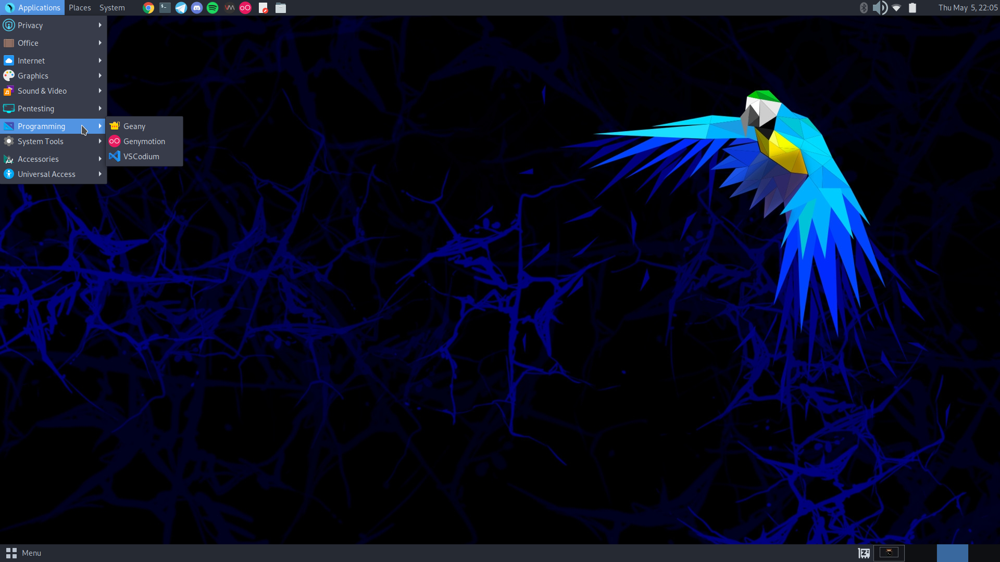
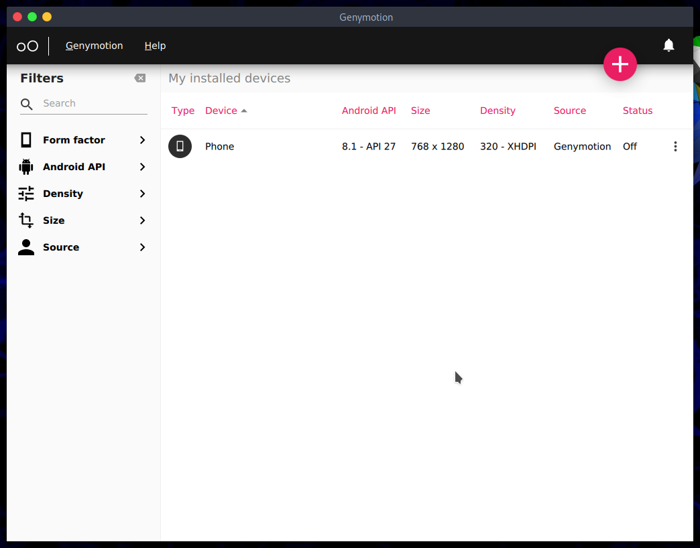
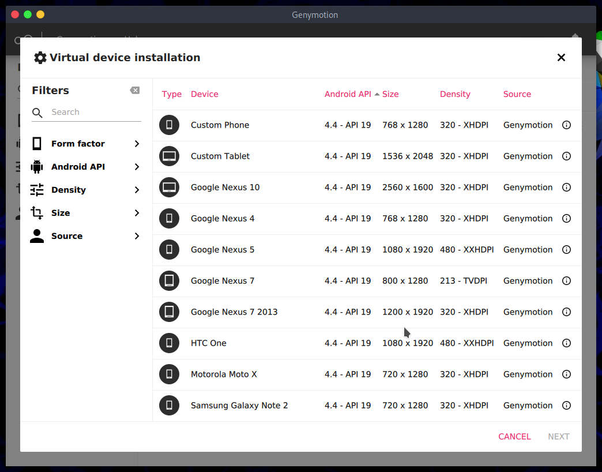
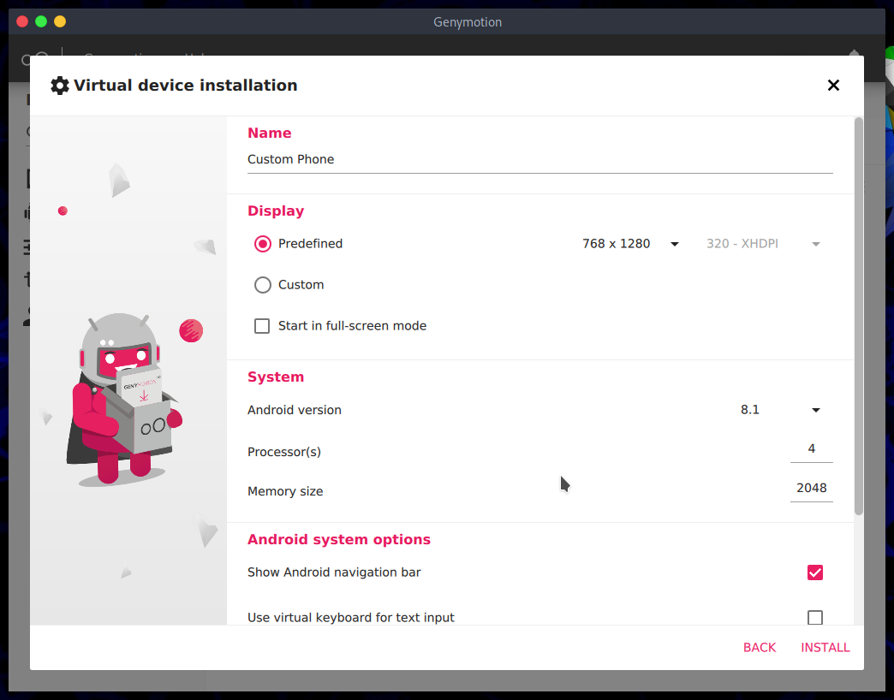
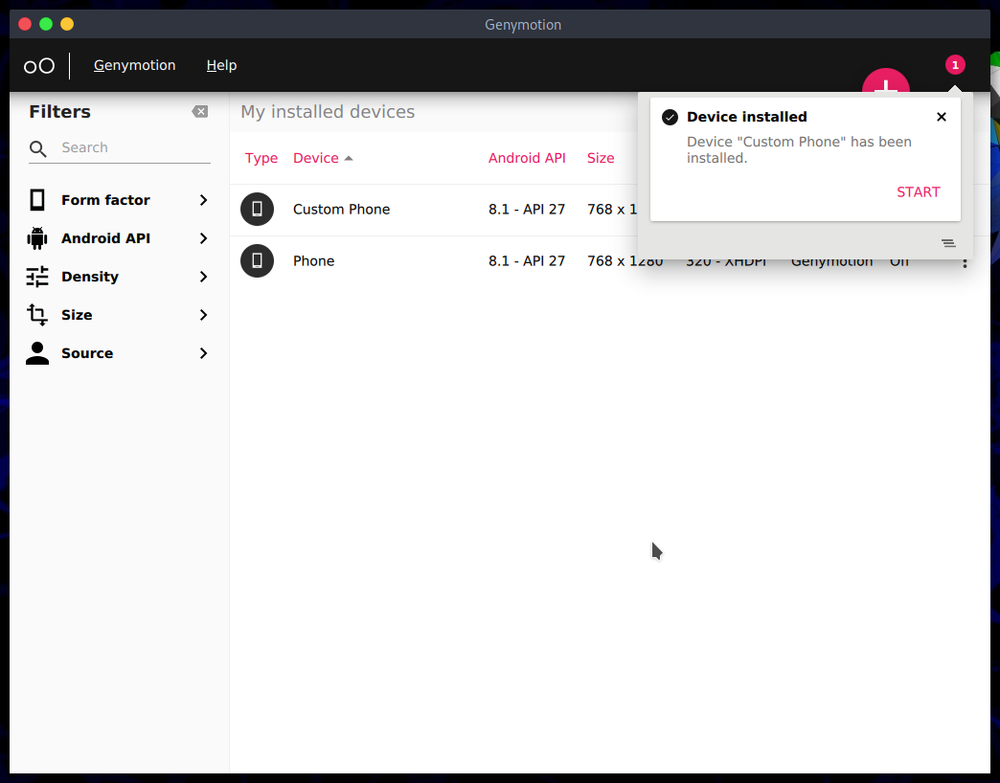
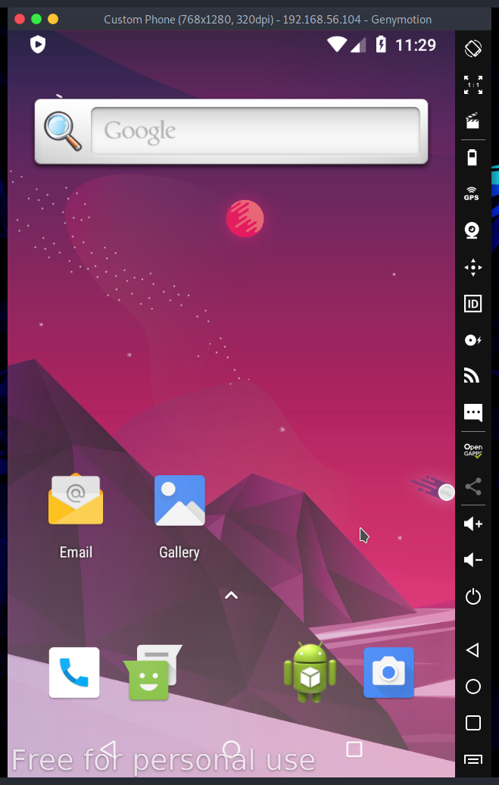
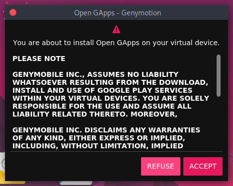
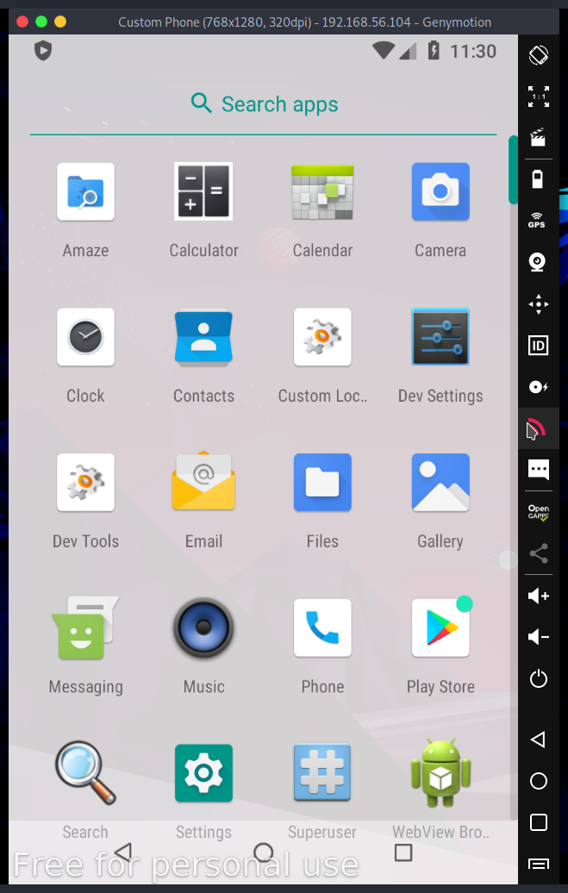
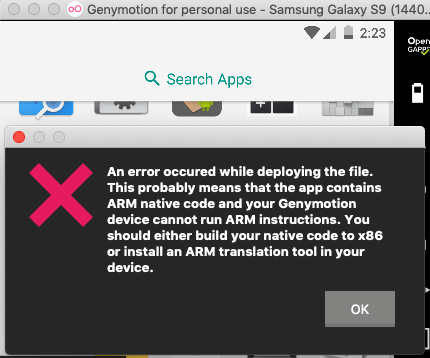

## Introduction

### Why?
Being able to install applications on different devices in your unix.

## Options
#### Anbox
The most common option you find on the internet is [anbox](https://anbox.io) which, as its name indicates, is a "box" that seeks to install android applications on linux, although it works for some, many application libraries do not go well at all, and the installation is very complicated starting for installing modules to the kernel of your computer following the amount of incompatibility and resources.
 


##### Android x86
Then I tried to create a virtual machine with [Android x86](https://www.android-x86.org) which is an open source project that creates bootable android images, so I ran it in qemu but it gave the same problems, it used too many resources and the installation of applications ended up being hell. Finally try to use [Prime OS](https://www.primeos.in) which is a fork of Android x86 but optimized for computers and as it is originally to run mobile games on a laptop it should work better at first, and so it worked a little better but not enough the installation of applications It is better and in this case I decided to install in physical hardware and not virtualized, and although it was better many of the applications did not work since Android x86 is a tablet so many applications are not optimized.


#### Genymotion

So I already knew what an android needed that was a cell phone with google services installed. It was there when I remembered that there was [genymotion](https://www.genymotion.com) which allows you to virtualize a complete android. It was originally made for app developers but it works for anything ;)

##### Why?
It's stupidly easy to install it's a linux binary and executables for mac and windows. The only requirement I noticed in linux was virtualbox but it was a matter of installing it with my package manager and everything was ready.

## Installation
For linux you have to first install virtual box (you can do it with apt install virtualbox) then you will download the genymotion installation binary from its [official download page](https://www.genymotion.com/download) and run it with: `./genymotion.bin`.

## Installation of android
Then you can search for the application and open it:

When you are in the dashboard you must press the plus icon and create a new device:

I choose a custom device, with the version of android 8.1

When the device is created we will start it:

## Configuration of android
### Google apps
To install Google services and the acclaimed Play Store you must click on the "open Gapps" section, then you will accept the installation, your device will restart and you will have the Play Store installed.


For manual installation go to the GApps page and [download](https://opengapps.org/?source=genymotion) the file then drag and reboot.


### ARM translator
Some apps will give you the following error to fix it, just download the [arm translator](https://mega.nz/folder/JhcFwKpC#yfhfeUzvIZoSdBgfdZ9Ygg) zip file, reboot and you are good to go.

