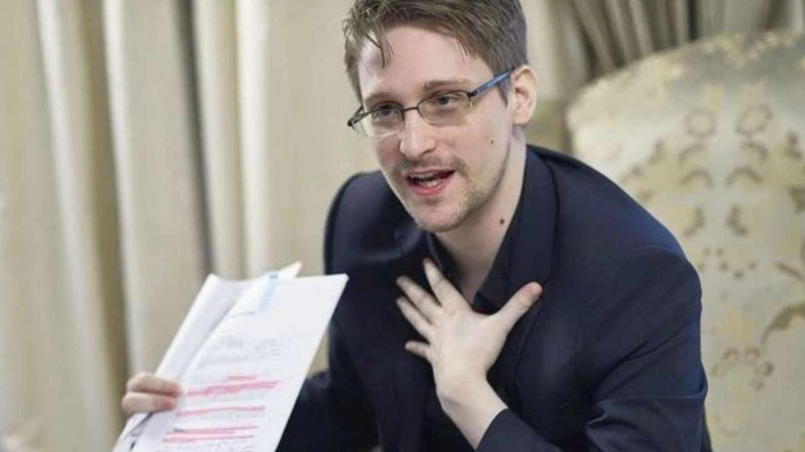
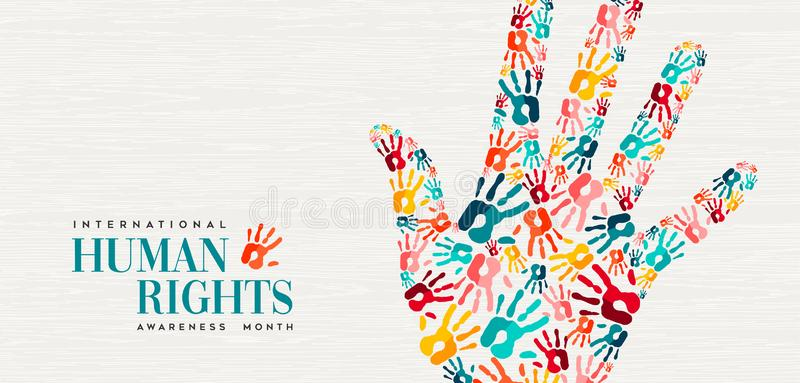

A debate that has always had the question of "**What do you have to hide?**" It has always been present when it comes to privacy on the internet, but how necessary is privacy?

## Basic
I think we should start at the beginning by defining privacy. The Cambridge dictionary defines it as:

> **"Someone's right to keep their personal matters and relationships secret"**

In computing we can save personal data, when we access a site or upload something to the internet, this data is created many times from locations, photos, relationships with other people or dates of birth. This often helps as the theme of saving cookies that you had in your shopping cart means that you do not have to add everything manually or save your email so that your friends can find you.

## The Problem

The problem begins when this data is used in a bad way or is shared with third parties or data not necessary for correct operation are saved. Some companies store data they don't need or sell it to third parties or use it in an inappropriate way. Your cell phone has a GPS and through this you can be traced by someone like the creator of the operating system or any application that you have installed.This is useful when you want to share your location with your friends but it is not when it is shared with other people for inappropriate uses.

### Examples

We all know about the [Edward Snowden leaks case](https://en.wikipedia.org/wiki/Edward_Snowden) and as the data collected by the NSA was correct and helped the well-being, **the problem arose when an investigation was carried out without a prior court order or only illegally to people who did not have to go through that**.

## A fundamental right
Yes, my answer to this is that privacy is a fundamental right outside and inside the internet and like all rights it is broken when it violates the rights of other people in this case privacy can be broken when it corrupts the rights of other example in a judicial situation or a police case. But here we also have a problem, like the Snowden case, it has been shown many times that giving this access always ends in misuse, so personally I do not like it and I do not agree with the non-privacy or delivery of third-party information, including governments due to the misuse that it has been given and could be.

## Tweet

I would like to end with the tweet that inspired me to write this post and the case of [ProtonMail](https://twitter.com/tenacioustek/status/1434604102676271106) which once a back door to our data will never be finished.


