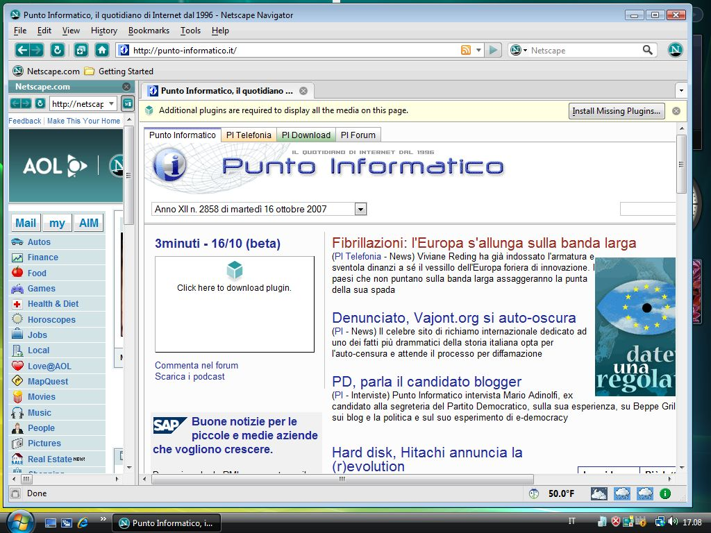
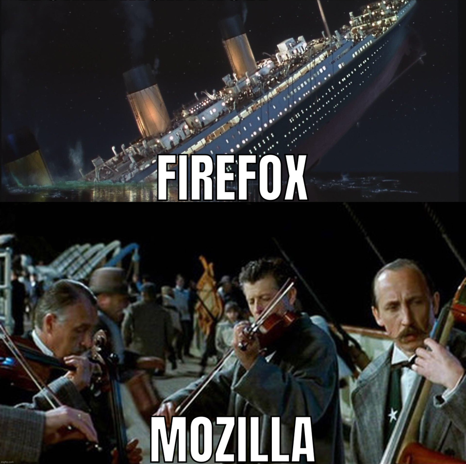

Firefox has accompanied us for years, it is always there in each Linux distro we install and for a long time there was a rivalry as to whether Chrome or Firefox was better, but will it be the end of the Fox browser?

## From the ashes of Netscape
We all remember the first war between browsers, the headache for web developers at that time when Microsoft and the now-defunct Netscape fought to the death for dominance of the web, the winner Microsoft, but before Netscape died he released his code so that was reborn from the ashes with another name Mozilla Firefox which until a few months ago was the 2 most used browser in the world and the main competition of Chrome that was not [Chromium](https://en.wikipedia.org/wiki/Chromium_(web_browser)).

## The domain in Linux
Firefox was by far one of the most used browsers in Linux and derivatives but due to the growing creation of chromium-based browsers this is ending more and more Mozilla has to lay off more employees and if Google stops paying it for Google Search be it the default search engine would be a hard blow for Mozilla and much more for the Firefox project. This could finish killing Firefox

## A painful ending
The death of Firefox could be painful every day it loses more users and according to the latest reports Firefox has lost 50 MILLION users and every day it loses more users. This means that you may lose too many users that the browser becomes obsolete and with the slowdown that many pages do to their sites if they do not use the Chromium search engine, many prefer another browser, if Firefox is left with fewer users it will make it less attractive for developers get involved in Zorro (Fox) :fox: browser.

## A light at the end of the tunnel
Let us remember that there are more browsers based on Firefox, one of them and possibly the most used [Tor Browser](https://www.torproject.org) which has a very large community and many of them are developers if Firefox dies and the community really cares, development will continue outside of Mozilla since if we remember Firefox is open source, so if Firefox dies the best thing that could happen is for people to come together and continue the Firefox legacy.

## The death of Firefox not Mozilla
Mozilla is the company behind Firefox and not only does it have Firefox, although it is their main product, they also have other services such as VPN or email, so if Firefox dies it may only die but not Mozilla.

## Conclusion
My conclusion is that if Firefox dies it will be slow and not suddenly or perhaps it does not die and only loses a large number of users. Many Linux distros are changing to Firefox as a pre-installed browser. In the same way, we hope the best for Mozilla.

The captain of the titanic stayed in his great ship, he saw how it sank little by little then will you be one of those who leave Firefox or stay to see how it sinks?

