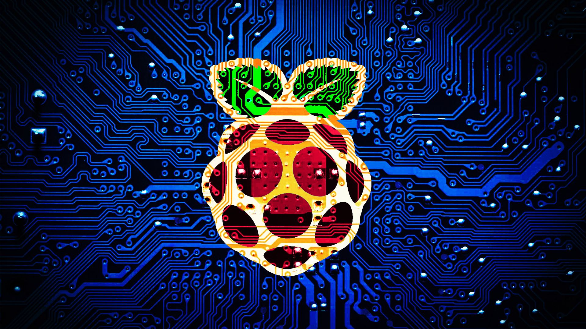

I would like to start this post with the following words: "Para que crear el agua tibia" or in English **"Why create warm water?"** this phrase is from my friend [Zeta](https://twitter.com/Zeta_0x00)/UCR. Now, why should you not create another Linux "distribution," why would you create something that already exists only with another name and here is the explanation.

## Debian
I want you to think about the number of Debian "distributions"that you know, this number is huge and they are distros that are useless and only damage Linux because many things have to be repackaged and makes use more difficult. So why create another Linux "distribution"?

For a better desktop environment, you can do it but why better not create the configuration and turn it into a script and that anyone can install it on their Linux

## Arch

And I will take as an example BlackArch a "distribution" based on Arch Linux and it is a "distribution "supposedly for Penetration and Pentesting but in reality it is unstable, with outdated packages and a peismic management of repositories, **IT IS NOT A "DISTRIBUTION"** it is actually a pure Arch Linux with a customization and a wrong repository, this makes BlackArch just a useless "distribution" and delays development.

## Linux in general

This is the most important thing, when a software/videogames company thinks of creating something in Linux, it sees the number of "distributions" that there are and the large number of package managers, having to package everything and make it stable for each of the distributions and their "derivatives".

### Linux time line
And if you didn't see this for a good reason I want some of the Linux distributions that exist:

And this image is missing a lot of distributions.

## When to create a Linux
I would consider taking these points and if the answer is yes a distribution should be created:

* Something specific and useful of which there is no distribution.
* When the options you have are not stable.
* Some specific architecture of which there is no other option at that time.

I will give an example of Linux that meet these requirements:

### Raspberry OS

[Raspberry OS](https://raspberrypi.org), previously called Raspbian, is the official Raspberry distro and the first for these boards, this meets requirement 3 and therefore it was necessary to create it and being based on Debian avoids many problems.

### Kali Linux

Everyone knows [Kali Linux](https://kali.org) and its predecessor BackTrack, for those times in 2006 there was no good distribution for Pentasting and when BackTrack arrived, now Kali this was solved, fulfilling point 1.

### Debian Linux

[Debian](https://debian.org) was one of the first stable distributions and the first in 1993 is an excellent distro and although it has been stained by its large number of unnecessary children, it still feels an excellent one in its original version unlike its badly made copies

### RedHat Enterprise Linux

Possibly and for me the most extable Linux distribution that exists, [ReadHat](https://www.redhat.com) really cares about the stability of Linux so much that it is a sponsor of the Kernel itself, and although it is mainly paid, it is well worth it.

### Fedora Linux

Based on RedHat and although it is possibly the RedHat distro testing it is totally free and does the same as RedHat in terms of stability only removing the support, this although it is based (there are not many distros based on RedHat unlike Arch or Debian) [Fedora](https://getfedora.org) It has a use respecting term 1.

## Conclusion
Creating Linux Distributions has its sales and its disadvantages. My personal recommendation is that if what you want is to generate an image with your configuration create but do not rename or change everything because you will only create another debian with a utility that already exists and is unstable.